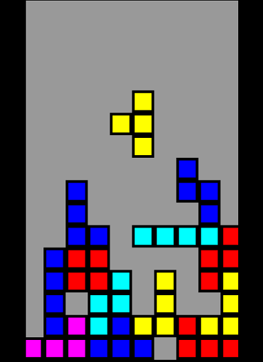

# Tetris
Clone of a popular game. Rewritten for many platforms.  

### About:
- One of my earliest projects while learning Java  
- Initial version developed for my [Motorolla L2](http://www.gsmarena.com/motorola_l2-1117.php) (128x160) phone in J2ME ([J2ME source](other_platforms/J2ME_src))
- Was later enhanced for my new [BlackBerry Pearl](http://www.gsmarena.com/blackberry_pearl_flip_8220-2521.php) phone and included new features such as resizing to fit device dimensions and the ability to save / load the game state ([BBry source](other_platforms/BBry_src))
- A few years later rewritten for Android platform and utilized touchscreen controls, dropping support for physical buttons ([Android source](other_platforms/Android_src))  ([Executable APK](https://github.com/arenex/Tetris/raw/master/other_platforms/Android_src/Android010_BbryTetris.apk))
- A modified version for Android featured Bluetooth multiplayer support for two (TBA)
- And finally ported over to HTML5 in plain JavaScript as featured in this repository ([HTML5 src](src/))

### How to Play (HTML5 version):
- on the Desktop version, use arrow keys ← ↑ → ↓ to move / rotate the shapes
- on the Mobile version, use touchscreen (far edges of the screen)

### Features:
- HTML5 Canvas, vanilla JavaScript
- FullScreen Resize - maintains proportional resize ratios independant of screen dimensions

### Demo
